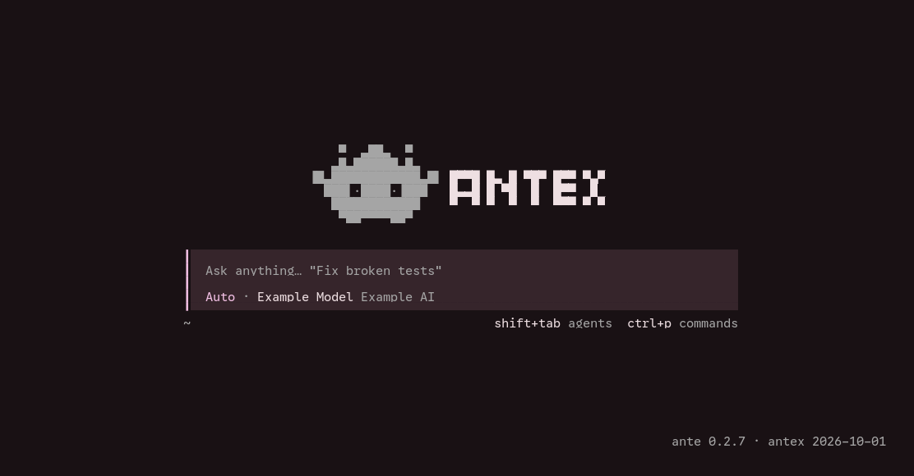

# antex（项目 ante-opentui）

> 最后核对：2026-10-01 · 目标客户端 opencode 2.0.18 · Rust 1.98.1

把 **opencode v2 自带的 TUI** 接到 **Ante** 后端上运行。

做法是**实现 opencode v2 要求的 server API**，让 `opencode --server <url>` 分辨不出真假；
opencode 的界面、主题、键位一行不改，Ante 提供数据。思路同「改接口，不改消费者」。



首页（本仓库自编客户端的默认界面）：顶栏是 Ante 面具 + `ANTEX`，composer 下是权限模式与模型，右下角是 `ante <后端版本> · antex <构建日期>`。**这张图由 `script/shot-home.py` 生成**（PTY + pyte 抓屏 → Pango 渲染，可复现）。

## 状态：已实现 / 待定 / 遗弃

**绿勾 = 已实现（实测过）；空框 = 待定（做得到，没做）；删除线 = 遗弃（Ante 底层没这个概念，别再提议硬做）。**逐条细节与验证法在「实现清单」。

### 已实现

- [x] 起界、提示词送达、真 Ante 回复、流式文本、推理、工具调用、审批、失败可见 —— 全由垫片喂真数据
- [x] 会话：列表、恢复、恢复后继续、删除（`Ctrl+D` 两下）—— 删的是 Ante 自己那条存档目录；**打开一条会话即从它的 `events.jsonl` 重建整份记录**（每一步的思考、回答、工具都在，见「记录回读」）
- [x] 插嘴与排队（`Ctrl+S`）+ 斜体 `Pending...` 标记 —— 送到时机按 Ante 的真实边界判：**收下不算，下一个 step 开始才算模型读到**
- [x] `/compact`、模型选择、`shift+tab` 权限模式、`@` 文件补全、贴图、herdr 上报、boot 接口全套
- [x] 多标签**临时**关掉（`tabs.mode = "off"`，只是个配置项，不是能力）—— 它要服务端同时驱动多条会话，垫片只有一条连接；真做多标签见「待定」那条
- [x] 做不了的入口从界面摘掉 —— 插件 / 键位 / 命令黑名单 / 侧栏卡片四层，见「屏蔽做不了的入口」
- [x] 断线重连，且掉线期间排队的消息不丢 —— 退避重连 + `health` 说真话 + 转录里一行说明；**回合没跑完就被杀掉的会话（盘上只有 `events.jsonl`）Ante 打不开**，这种会话会新开一条继续，见「实现清单」那条

### 待定

- [ ] `/rename` —— 隐藏中；补法：写 Ante 那条会话的 `meta.json` 标题
- [ ] `/copy`、`/export` —— 隐藏中；补法：垫片用 `GET …/message` 拼一份导出载荷
- [ ] `/stats` —— 隐藏中；补法：Ante 的 `meta.json` 里有 usage，够算 token / 成本
- [ ] `/skills` —— 隐藏中；补法：列出 Ante 自己的技能目录（`~/.agents/skills`、`~/.ante/.system/skills`）
- [ ] 会话内 `/cd` —— 家目录下能用，会话里是空操作；退一步可「按新目录重开会话」
- [ ] 真多标签（session tabs）—— **待定**：先验证 Ante 侧能否并发驱动多条会话，再谈垫片改造（现在只是把入口临时关掉）
- [ ] 断线时的终端还原 —— TUI 只弹 `Connection lost · Reconnecting to the server automatically.`，终端留一屏裸 SGR；抓原始字节：用 PTY 跑一次（`script/tui_drive.py` 就是这条路子），把读到的 chunk **先原样落盘再喂 `pyte`**——SGR 序列只在原始字节里看得见

### 遗弃

- [ ] ~~`/undo`、`/redo`、消息菜单的 Revert~~ —— Ante 协议 18 个 op（`StartSession`…`Shutdown`）没有 revert/undo/rewind，`~/Projects/ante` 全仓 grep 零命中；硬做只剩重写 `events.jsonl` 截断历史——只对以后 resume 生效、对当前会话无效、还可能被 Ante 覆写
- [ ] ~~`/fork`~~ —— 无分叉 op
- [ ] ~~`/share`、`/unshare`~~ —— 云端分享，Ante 无此概念（客户端自己也直接报 "Sharing is not implemented for V2 sessions yet"）
- [ ] ~~`/mcps`、`/status`、MCP 面板~~ —— 无 MCP
- [ ] ~~`/connect`、`/pair`~~ —— 无 provider OAuth、无设备配对（`/api/integration` 恒空）
- [ ] ~~`/diff`、`/worktrees`~~ —— 无 diff / VCS / worktree 概念（`/api/vcs/*` 只能答空；`/api/vcs` 因此答**空分支** `{branch:{}}`，位置标签才不会挂上假 `:main`）
- [ ] ~~`/terminal`、Terminals 面板、`!` shell 模式~~ —— 无 PTY、无 shell 会话 op（Bash 是工具调用，不是终端）
- [ ] ~~`/plugins`、`/btw`~~ —— 无 opencode 插件系统；`/btw` 要的是「旁问」的独立 generate op
- [ ] ~~`/reload`、`/update`、`/restart`、`Ctrl+B` 后台化工具~~ —— 重新加载服务端配置 / 更新 opencode / 把工具调用扔后台，对 Ante 都无意义（**暂时遗弃**：等哪天有对应 op 再说）
- [ ] ~~LSP、formatter~~ —— 无对应概念，打桩显示为空（入口已摘；**暂时遗弃**）
- [ ] ~~子代理面板 / 点进子代理~~ —— 客户端的子代理 UI（内联块点进去看子会话、composer 的 subagents tab、mini 的 footer inspector）**整套都挂在「子代理 = 独立 child session」上**（`session.parentID` + 自己的事件流 + `sessionFamily()`）。Ante 没有这个概念：子代理只是父会话里的一次 `Agent` 工具调用，内部活动不推给前端——本机 188 条会话日志里 `ToolUpdate` 事件 **0 条**，一次 68 秒的 `Agent` 调用（14:42:20→14:43:28）中途**零事件**，结果只在 `ToolEnd.result_json.report` 里一次交付；协议里也没有 agent id / parent turn（`SessionInfo.subagents` 只是可委派清单）。硬造 child session 只有空壳，还会污染会话列表。能做的只有把 `Agent` 调用按客户端的 subagent 块渲染（已做）

## 它在你系统里的位置

```
opencode 的 TUI（本仓库自己编的，改了 logo）      ← 界面
        ↕  opencode 协议（本仓库实现的「垫片」）
antex（垫片，本仓库，一个二进制）
        ↕  ante-sdk / `ante serve --stdio`
Ante（**你自己装的**：官方脚本装、`ante update` 升级）
```

**Ante 不在本仓库里，也不用管它**——你装你的、它更它的，垫片按它的协议趴在上面。
唯一耦合点就是协议：若 Ante 升级改了协议，改垫片即可（通常只动 `Cargo.toml` 里的 `ante-sdk` 版本 + `cargo build`）。

## 为什么走这条路

手写复刻 opencode 的 TUI 到不了它的完成度（它有 17k 行的界面层）。反过来做，垫片是**可丢弃**的一层：
上游界面升级时，重新拉 TUI 即可，只需跟着修垫片。代价是 Ante 没有的概念（LSP、MCP、formatter、OAuth、git 操作）必须打桩。
思路同「改接口，不改消费者」（参照 `onarchi`——把 Omarchy 真移植到 niri 的那个仓，原名 omarchy-on-niri）。

几条定下来的选择：

- **Rust 写垫片**：它是长驻进程，要稳、要单文件产物。
- **上游进同一个仓**（`vendor/opencode/`，git subtree，分支 `v2`）：升级即拉上游，本质就是打补丁。
- **只做垫片、不 fork 界面**：日常使用不必依赖自建前端（源码模式要 3.1G `node_modules`），**只有要改界面本身才必须 fork**。
- **映射原则**：Ante 真有对应概念的才做成真差别（`shift+tab`→权限模式、模型选择→provider/model）；没有的（LSP/formatter/VCS）打桩显示为空，不假装。

## 实现清单

**未实现（一条也不再单独列：分类、补法、依据都在开头「状态」那份清单里）**

**已实现（均已实测）**

- [x] **真 v2 TUI 起界** —— 顶栏、块字 logo、composer、页脚全部由垫片喂出
- [x] **提示词送达** —— `POST /api/session` → `POST …/model` → `POST …/prompt`
- [x] **真 Ante 回复** —— `ante-sdk` 连 `ante serve --stdio`；模型名、耗时、token 均为真实数据
- [x] **流式文本** —— `step.started` → `text.started` → `text.delta` ×N → `text.ended`
- [x] **推理（thinking）** —— `session.reasoning.started/delta/ended`，显示为 `+ Thought · 762ms`
- [x] **工具调用** —— 发出去的工具名按**客户端的拼法**映射，于是每一步都由客户端自己的单元格渲染，而不是通用的 key/value 块。映射表（`client_tool_name` / `client_tool_args`）：`Bash`→`shell`、`Read`→`read`、`Write`→`write`、`Glob`→`glob`、`Grep`→`grep`、`WebFetch`→`webfetch`、`WebSearch`→`websearch`、`Agent`→`subagent`、`AskUser`→`question`，另把 `Read`/`Write` 的 `file_path` 补一个 `path`（客户端只读 `path`）。实测渲染：`$ echo hi` + 输出、`✓ General Subagent — 查 activspot 是什么`、`→ Read demo.md`（探索类会被客户端并成 `Explored: 1 read` / `1 search`）、`→ Asked 1 question`（**选项不在这一格里**，见下条「提问」）。**没映射的**：`Edit`（它的单元格要预计算的 patch 元数据，硬映射只会退化成空块）、`TodoWrite`、`ViewImage` —— 保留 Ante 原名、继续走通用块（参数与输出都在）。**也没转的**：Ante 的 `ToolUpdate`（子代理排队等 slot 时才发）没转成 `session.tool.progress`——那个事件只喂单元格的 metadata 字段，而 Subagent 单元格不读它，转了界面上看不出差别。**子代理只有这一层**：Ante 不推子代理内部活动，所以块里不会长出子会话（见「遗弃」）
- [x] **提问（`AskUser`）—— 选项列表** —— 工具单元格只会写 `→ Asked 1 question`：**选项在客户端自己的「表单」里**（`routes/session/form.tsx`；单选的坑位是 `string` 字段带 `options`，客户端没有 enum 字段类型），而垫片原先从不发 `form.created`、`/api/session/{id}/form` 还恒答空，于是提问在界面上等于没有选项。现在 `ToolStart(AskUser)` 除三个 tool 事件外再发一条 **`form.created`**：Ante 的 `questions[]` 逐条落成一个 field（`header`→`title`、`question`→`description`、`options[].label` 同时当 `value` 与 `label`、`multiple` 决定 `multiselect` 还是 `string`、`custom` 默认开＝允许写选项外的答案），form 的 `id` 由 `call_…` 推出（同一问不会开两次）、`metadata.tool` 指回那条调用。三条路由补齐：`GET …/form`（列在挂的那份，裸 `{data:[…]}`，schema 同 `/inbox` 一样严格）、`POST …/form/{id}/reply`、`DELETE …/form/{id}`（取消）。**答案怎么回到 Ante**：Ante **没有「作答」这个 op** —— 提问是被**下一条用户输入**结掉的（实测 `ToolStart` 之后 56 秒才 `ToolEnd{Completed}`，正是用户下一条消息到达那一刻），所以 reply 把选中的 label 拼成一条普通用户消息（`回答提问：` + 每问一行 `- <header>：<label>`）走**原本的 prompt 路由**（`session_prompt`），转录里出现的就是用户自己那句话、模型那边收到的也是它；`DELETE` 则什么都不发（Ante 撤不回，下一条消息照样结掉）。调用结束时（`ToolEnd`）按 call id 清掉在挂的 form 并发 `form.cancelled`，提示不会比调用活得久。**必须带 `location`**：客户端 store 里**第二段 switch 的开头就是 `if (!event.location) return`**（`packages/client/src/solid/data.ts`），`form.created` 正落在那道门后面——而垫片所有事件都不带 `location`，于是这条被读进来又**静默丢掉**：没有报错、没有日志、`GET …/form` 照样取得到，只按 curl 验会误判成「垫片没问题」。现在这三条 form 事件改走 `publish_located()`（事件级 `{"directory":…}`），而且 **form 对象自己也带一份**：客户端的 `removeForm` 对没有 location 的 form 一律放行（＝永远摘不掉提示）。同一支里还有 `provider.updated` / `model.updated` / `vcs.branch.updated` 那类目录事件，垫片**有意**不发它们（`permission.asked` 在前一段，所以审批一直好使）。**验证法**：`antex serve PORT` + `curl` 只能验垫片这一侧——`POST /api/session` 建会话 → prompt 一句「请调用一次 AskUser 问我…」→ `ANTE_SHIM_TRACE` 里出现 `PUB form.created` 且 `GET /api/session/<id>/form` 取得到它 → `POST …/form/<formID>/reply -d '{"answer":{"q0":"…"}}'` 回 204、列表随即为空、trace 里 `Evt::UserInput` 带的正是那条「回答提问」文本。**要算过必须进 TUI**：`script/tui_drive.py --send '18:请调用一次 AskUser 问我：午饭吃什么？两个选项：吃面、吃饭。\r' --send '45:\r' --after 45` → 屏上先出 `1. 吃面 … 3. Type your own answer` 与 `↑↓ select  enter submit  esc dismiss`，回车后转录里出现用户那条 `回答提问：` `- 午饭：吃面`、模型接着往下走（本机已实测）
- [x] **审批** —— Ante 暂停 → TUI 弹 `△ Permission required` → 在 TUI 批准 → `ApprovalResponse` → Ante 继续执行
- [x] **消息顺序与去重** —— `inbox.enqueued`+`delivered` 入列表；复用客户端提交自带的 message id。**顺序的坑**：客户端收到 `session.inbox.delivered` 会把那条 prompt **移到转录末尾**（`packages/client/src/solid/data.ts` 的 `draft.splice` + `draft.push`），而 `session.step.started` 会追加助手消息——所以垫片**必须先发 `delivered`、再发 `step.started`**，反过来就把回复画在提问上面。另有一处重复：回合结束的收尾（`take_steers`）会把**已经送达过**的 steer 消息再宣布一次，客户端于是又把它推到末尾（这一次推到回复之后）；现在 step 边界发过 `delivered` 的会记进 `Store::delivered`，收尾时用 `claim_delivered` 跳过。**验证法（不必进 TUI）**：`ANTE_SHIM_TRACE=/tmp/t.log antex serve PORT` → 建会话并发一条 prompt → `/tmp/t.log` 里 `PUB session.inbox.delivered` 必须**只有一条**，且紧跟在 `PUB session.step.started` **之前**
- [x] **多轮消息落位** —— 三条连发实测：用户与回复正确交错（前两条因排队相邻属正常）
- [x] **中断收尾** —— Esc 两下（第一下上膛、第二下中断）后 Ante 正常收尾：工具单元格变 `✗`、转轮停止
- [x] **失败可见** —— Ante 那轮失败时补发 `session.step.failed` + `session.execution.failed`（两者都必带 `error`），TUI 显示 `Error: …` 而不是空转
- [x] **会话列表 / `/sessions`** —— `GET /api/session` 列 `~/.ante/sessions/*/`（实测 209 条 = `ls ~/.ante/sessions | wc -l`、时间倒序、标题=首条用户消息）。**优先读 `meta.json`；缺失时从 `events.jsonl` 兜底**——Ante 只在 `TurnEnd` 写 `meta.json`，回合没跑完的会话只有日志（见下条）。**选择器实测已列出真 Ante 会话**；**每条都报垫片自己的 location**（`prj_shim` @ `default_directory()`）——报 Ante 的真实 `dir` 会让选择器去 sync 一个 `/api/location` 答不出的目录，于是第二次打开变成 "Could not load sessions."
- [x] **恢复会话：历史渲染** —— `/sessions` 选中一条即加载历史（用户消息 + 助手回复 + 工具块）。**病根：`GET /api/session/{id}` 少了 `data` 信封**（该路由 schema 是 `{data: Session.Info}` 且 `additionalProperties:false`），客户端读 `response.data.id` 得 undefined，抛 `undefined is not an object (evaluating 'Ae.id')`，**只在界面上弹个小 toast、不换视图**——所以看着像「点了没反应」
- [x] **记录回读（打开会话时那份 transcript）** —— 打开一条会话，客户端会 `GET /api/session/{id}/message`（`limit=20&order=desc`），拿到后**按 id reconcile 整份替换**本地记录。垫片这份数据原先有两个毛病：① 会话正在跑时它回的是自己的内存副本，**而那份只有用户自己发的提示词**（助手内容一律由客户端自己从事件里折）——于是再读一次，回答、思考、工具全被抹掉，只剩一串光秃秃的用户消息（顺序看着也就错了）；② 不在跑时走的是 v1 折叠，**只认 `UserInput` / `TurnStart` / 最终文本**：思考块、工具调用、多步全丢，且 `AgentMessage` 只认「上一条是 assistant」——**插嘴一条之后，后面每一步的回答都被静默丢掉**。现在改成**一律从 Ante 的 `events.jsonl` 重放**，按 opencode 的真实形状折：**一个 step（一次模型调用）一条 assistant 消息**，内含 `reasoning` / `text` / `tool` 三种 part，工具由 `ToolEnd` 收尾成 `completed`/`error`、`UsageUpdate` 填 tokens、`TurnEnd` 收尾（失败的回合单独落一条带 `error` 的 assistant 消息）。两处 id 必须和客户端对得上，否则一次重读要么翻倍要么丢：
  - **assistant**：id = `msg_<turn_id>_<第几步>`（`step_message_id`）。活会话的 pump 与日志重放**用同一个函数算**，所以同一 step 在哪边都是同一个 id；
  - **user**：`Store.handed`（交给 Ante 的文本 → 客户端自己的消息 id）在重放时认领回去——客户端那条是它自己铸的 id，换一个就会出现两条一样的提问。`forget_sent` 会在交付时清掉映射，所以这份另存；
  - 客户端自己的会话 id 与 Ante 存档名不同时，回读要先用 `Ante::archive_of` 映射到存档（否则读的是不存在的目录，transcript 直接空）。
  **客户端补两处**（见「首页 logo」那节补丁清单）：拉取不再丢掉「这次没提到的行」（idle / compaction / 切换 / 正在流的那一步都是客户端自己从事件折的），以及 `editText` 在缺 text part 时补建一个（重读恰好落在一步中间时，后续 delta 才不会无处可落）。**验证法**：`antex serve PORT` → `curl -s 'localhost:PORT/api/session/<存档 id>/message'`，一条多步会话应是「用户 → 每步 think/text/tool → …」，`TurnEnd` 那条带 `time.completed`；活会话再抓一遍 SSE 里 `session.step.started` 的 `assistantMessageID`，应与回读出的 id 逐条相等。**TUI 验证法**：`script/tui_drive.py --send '12:/sessions\r'`，帧里应列出真 Ante 标题；再手动选一条带工具的会话，帧里应看到 `+ Thought` 与 `✓ Bash [...]` 行（选择器里发键不落：中英文都试过，最终帧仍停在未过滤的列表上——这一步留给手）
- [x] **恢复旧会话后继续对话** —— 从前垫片只认「本进程第一个 prompt」建的那一个 Ante 会话（进程级 `started` 标志），此后的 prompt 一律 `UpdateSession`+`UserInput`，**从不看 URL 里的会话 id，也从不发 `Op::ResumeSession`**——消息因此进了当时那个新会话，只是事件按 `active` 路由，**看着**留在旧会话里（磁盘上则是另一条会话）。现在 `Ante.live` 记住当前连接驱动的会话：prompt 指向别的会话、且 `~/.ante/sessions/<id>/` 有存档就 `ResumeSession`（真续写，Ante 把新内容写回该 id 的日志），没有存档才 `StartSession`。**顺带处理 ResumeSession 自带的整份历史重放**：`Ante.replay_turn` 守卫把它丢掉，直到我们自己那条 `UserInput` op 触发的 `TurnStart.turn_id` 出现（该值就是那条 op 的 id）；被拒或 20s 超时则放行并清掉绑定，下一条消息重新定位。**验证法（不必进 TUI）**：`antex serve PORT` 起服务 → `POST /api/session` 建会话并 prompt 一次（Ante 那边落一条新目录 `ses_A`）→ 再 prompt `ses_A`、以及另一个已有目录的会话 → 核对各自的 `.ante/sessions/<id>/events.jsonl` 有没有收到新 `UserInput`（判据：消息落进**被指向的那条**）；同时本轮 SSE 里 `session.step.started` 只能出现一次，多于一次就是重放没挡住。垫片日志出现 `ante: 切到旧会话 <id>（ResumeSession）` 即走了恢复路径——一体化模式看 `/tmp/antex.log`
- [x] **删除会话（`Ctrl+D`，按两下确认）** —— `DELETE /api/session/{id}` → 删掉 `~/.ante/sessions/<id>/`（**Ante 自己的存档，删了所有前端都看不到**，返回 204）；id 必须是单一路径段（否则 400），没有存档回 404，正在跑的那条拒删（400，先 Esc 中断）。**要删的是 Ante 的存档名，而客户端新会话用的是它自己编的 id**（`StartSession` 不接收 id，Ante 自己铸 `ses_01M3…`）——靠 `Evt::SessionStart` 里带的 `session_id` 建立对应（`Ante.archives`），否则按客户端 id 删会 404。**顺带修掉两个「会话凭空消失」**：① 列表原先只读 `meta.json`，而 Ante **只在 `TurnEnd` 写它**——回合没跑完（卡在提问 / 被杀）的会话只剩 `events.jsonl`，于是从列表里消失；现在缺 `meta.json` 就从日志取首条 `UserInput` 当标题、首个事件时间当创建时间（模型回落到当前配置）。② 续写判据同样从「有 `meta.json`」改成「有目录」，否则这种会话被打开时会**另开一条新会话**、历史看着少一半。**已知边界**：删完若还有**孤儿 Ante 进程**（`fuser -k` 只杀垫片，`ante serve --stdio` 子进程还活着），它退出时会把 `meta.json`/`dialog.json` 写回目录（实测复现，`events.jsonl` 不会回来）——真要清干净就确认目录不在了。**验证法（不必进 TUI）**：`antex serve PORT` → （a）`curl -X DELETE localhost:PORT/api/session/<编的 id>` → 404；（b）`POST /api/session` 建会话 + prompt 一次 → 用**客户端那个 id** 删 → 204 且 Ante 目录消失、垫片日志出现 `session: 删除会话 <id>（存档 …）`；（c）挑一条没有 `meta.json` 的存档（`ls ~/.ante/sessions/*/meta.json` 比对）→ 列表能看到它，prompt 一次垫片日志出现 `切到旧会话 …（ResumeSession）` 且新事件落进**同一个**目录
- [x] **插嘴 / 排队（`Ctrl+S`）** —— opencode 的提交带 `delivery`：`steer`（回车，默认）走 Ante 的 **`Op::Steer`**，插进正在跑的那一轮；`queue`（`<leader>return`）**由垫片自己持有**（`Store::pending`），到回合边界（`TurnEnd`）才作为 `Op::UserInput` 交给 Ante——Ante 撤不回已提交的输入，放在垫片手里「插嘴 / 删除」才都算数。补齐 inbox 三件套：`GET …/inbox`（列出持有的条目，字段含 `delivery`/`payload.text`）、`PATCH …/inbox/{id}`（`{"delivery":"steer"}` 插嘴、`"queue"` 保持；该条已交给 Ante 时回 **409**）、`DELETE …/inbox/{id}`（丢弃；同样对已交给 Ante 的回 409）。**客户端侧补了上游没有的键位**：`ctrl+s`（见「首页 logo」那节的三处补丁）
- [x] **「未送达」标记（插嘴 / 排队的消息，模型读到没有）** —— 递出去 ≠ 模型看见了：`Op::Steer` / `Op::UserInput` 只是**递给** Ante，`Evt::UserInput` 也只是 Ante **收下**（实测工具还在跑时就发），真正进上下文是**下一个 step 开始**那一下。所以 `session.inbox.delivered` 不再在提交时发：收 `Evt::UserInput` 只把该条记进 `Store::acked`，等 `session.step.started` 才发 `delivered`（`take_acked`）；`TurnEnd` 把仍没送到的（`take_steers`）按已送达收尾——否则角标会一直挂着。`flush_queue` 与 `PATCH …/inbox/{id}` 也只把持有时那条改成 `steer`（**不**算送达），「已交给 Ante 的改不回去」由此自洽。客户端在消息下方画一枚**斜体 `Pending...`** 角标，队列 dock 从 `N queued` 改成 `N Pending... · 内容`（`routes/session/index.tsx`）。**验证法（不必进 TUI）**：`antex serve PORT` → `POST …/prompt`（`delivery: steer`）后立刻 `GET …/inbox` 应看到那条挂着；`ANTE_SHIM_TRACE` 里 `Evt::UserInput` 之后**不能**紧跟 `PUB session.inbox.delivered`，要等该轮的下一个 step。**TUI 验证法**：`script/tui_drive.py --send '8:请调用一次 Bash 跑 sleep 30，然后再汇报。\r' --send '22:插一句：结束后末尾加一行 END。\r'`，插嘴那条的角标应一直挂到 `sleep` 跑完、下一步开始
- [x] **多标签（session tabs）临时关掉** —— opencode v2 的 session tabs 要服务端**同时**驱动多条会话：切标签就是切会话，而垫片只有一条 Ante 连接（`Ante.live`），多标签一「同步」（客户端会替每个标签预取 message / pending / permission）就互相抢会话，界面整个乱掉。真做得让垫片并发驱动多会话，代价不合算，**先临时关掉**（摘掉入口而已，真开发多标签挂在「状态」的待定里）：`~/.config/opencode/cli.json` 里 `tabs.mode = "off"`（herdr 里本来就是 auto→关，现在哪都一样，切会话走 `/sessions` 或 quick slot）
- [x] **Ante 做不了的入口从界面里摘掉** —— 见「屏蔽做不了的入口」一节
- [x] **思考块按时收尾** —— 真 server 的推理是「一次性 `reasoning.ended` + 全文」，Ante 是流式 delta、而聚合的 `Thinking` 要等整步结束才到（实测比正文晚 1 秒以上，期间那行 `Thought` 一直转圈）。垫片自己缓存 delta，遇到首个正文 delta / 工具调用 / 回合结束就把 `reasoning.ended`（带缓存全文）补在正文前面，顺序回到标准的 `reasoning.ended` → `text.started`
- [x] **首 token 那几秒不空屏** —— 实测「提交 → 模型吐第一个字」有 **2.3 秒**（思考型模型预填期间不产出任何内容），那段的转录区**一片空白**，只有页脚在动；垫片造不出不存在的 part（硬塞会留下假 `Thought` 行）。改成客户端补一行占位（`routes/session/index.tsx`：会话在跑、且没有任何未完成的助手消息时画 `⠦ Thinking`），实测空窗 **2341ms → 169ms**，真推理行一到即接管（见「首页 logo」那节的第四处补丁）
- [x] **模型选择** —— `/api/model`、`/api/provider` 由 **Ante 的 `~/.ante/catalog.json` 驱动**（实测 81 个模型 / 9 个 provider），默认项取 `settings.json` 的 `provider`+`provider_model` 并排在首位；客户端选的模型在建会话与 `POST …/model` 两条路径都会下发 Ante（对应 `StartSession` / `UpdateSession`）。**会话对外报的模型**跟客户端走：建会话时记下 body 里的那对、切模型时就地更新，`GET /session/{id}` / 会话列表 / 历史回放各读各的（内存副本或 Ante 自己的 `meta.json`）；只有客户端一次都没选过才回落到 `settings.json`——之前这几处一律报 `settings.json` 那对，于是列表里显示着一个该会话从没跑过的模型。
- [x] **`shift+tab` 切权限模式** —— 三项**直接用 Ante 自己的说法**（`auto`/`strict`/`yolo`，不经过 opencode 的 build/plan 再翻译），实测 composer 循环 `Auto → Strict → Yolo`，且**以 `settings.json` 里配的那个打头**；切换是真差别（`strict` 下危险命令弹审批）。**agent 是在「建会话」的 body 里传的**（`{agent, id, model, location}`），不是发消息时
- [x] **boot 接口全套** —— `health` `location` `fs/list` `agent` `provider` `model` `config` `vcs` `project` `plugin` `migration` …。**`/api/health`（同 `/api/info`）的版本自报**：`version` = **Ante 后端版本**（启动自检时 `ante --version` 读到的，如 `0.2.5`；读不到则 `unknown`），`antex` = **构建日期**（`build.rs` 烤进去，如 `2026-09-29`——垫片自己没有发布节奏，跟着 Ante 和 opencode 走，日期就是它的版本）。响应还带 `urls`/`paths`，凑齐客户端 `ServerInfo` schema 声明的字段。**首页右下角就渲染这两项**（见「首页 logo」一节的第五处补丁）。**验证法**：`antex serve 41999` 后 `curl -s localhost:41999/api/health`，与 `ante --version` 对照
- [x] **`@` 文件补全** —— 垫片**自己读文件系统**（Ante 无文件 API）：`/api/fs/list` 列目录、`/api/fs/find` 递归搜索（跳过 `.git`/`node_modules`，深度≤6、limit≤50）。实测敲 `@` 列出家目录、输入 `main.rs` 命中真文件
- [x] **次要事件** —— `session.step.streamed`（每个 step 一次，`ensure_streamed!`）、`session.renamed`（新会话首条消息定标题）、`session.model.selected`（切模型，带 `previous`，读旧值在覆写之前）。`instructions.updated` 不适用（Ante 无此概念）
- [x] **命令行参数** —— `[PORT]` / `--port PORT` / `-h|--help`；不认识的参数打印用法并以 2 退出；**端口被占给明确提示、不再 panic**
- [x] **`/compact` 压缩** —— `POST …/compact` → Ante 的 **`Op::Compact`**（真压缩，不是假动作）。**Ante 不用 `CompactStart/CompactEnd` 报进度**（那只在真做了缩减时才发），日常走 **`InfoBlockStart`/`InfoBlockAppend`（id 以 `compact` 开头）** → 映射成 `compaction.started/delta/ended`；另补 **inbox 握手**（`enqueued`+`delivered`），否则客户端把队列项一直挂在底部不落正文。实测：Ante 回「Context is already within budget; nothing to compact.」，UI 出 `Compaction` 块
- [x] **客户端实际调用的接口全覆盖** —— 对照一次完整使用过程收集到的 **32 条请求**，补齐了原先漏掉的 9 个：`/api/form`、`/api/shell`（GET+POST）、`/api/reference`、`/api/integration`、`/api/project`（**裸数组**，同 `/api/config`）、`/api/mcp/resource`（`{resources,templates}`）、`/api/vcs/base`（`data: null`）、`/api/vcs/diff`、`/api/experimental/session/{id}/terminal`（`{data}`）。Ante 没有这些数据，**但形状严格照 schema**——原先落到通用 fallback，它多带一个 `info` 字段，恰好违反这些路由的 `additionalProperties:false`，客户端会把整个响应校验掉、面板**静默为空**
- [x] **Herdr 上报** —— 跑在 herdr pane 里时由**垫片自己**上报 pane 状态（`idle`/`working`/`blocked`）与 Ante 会话 id，压过 herdr 内置的「把客户端认成 opencode」的检测。见「Herdr 集成」
- [x] **贴图（图片附件）** —— 客户端把粘贴的图作为 `data:` URL 放进 prompt body 的 `files`，而 **Ante 协议里没有图像字段**（`Op::UserInput(String)`，只有文本）。垫片走 Ante 自己认的那条路：**把图落盘到 Ante 的 paste 缓存（`$TMPDIR/ante-paste-cache/`）并在文本末尾追加 `@路径`**——Ante 的 TUI 和它的 ACP 前端都是这么送图的。细节与坑：
  - **必须压**：Ante 对超过约 240KB base64（≈170KB 原文件）的图是**丢弃**（给模型一句「图太大」），不缩放；实测 2400×1600/118KB 能读、2000×1400/15.5MB 读不到。垫片自带阶梯压缩（`src/attachments.rs`，`image` crate：长边压到 ≤1568，PNG 源优先 PNG、照片走 JPEG 质量阶梯），目标 ≤160KB，达标即停。
  - **回显**：客户端自己不带图（源码注释写明 file 内容由 server 加载），所以垫片把压好的图塞回 `files`（`{data, mime, source:{type:"inline"}, name}`）——`payload.files` 给 inbox、message 对象的 `files` 给转录区。**没开 TUI 的图片预览开关时，转录区只显示一个 ` file <名字> ` 标签**。
  - **`Evt::UserInput` 的回显会变长**：Ante 会把提及展开（提到某目录时加一段 `<folder-structure>`），所以「消息送达没」的比对不能拿用户原文比——垫片另存「实际发给 Ante 的那份文本」（`Store::sent`，按 inbox id），比对时先剥掉展开段。
  - **`file://` 附件**（`@` 补全带上的文件）**不加提及**：客户端文本里本来就有 `@路径`，Ante 自己会读；只回显。
  - **历史回放**：Ante 日志里存的是带提及的文本，回放时把垫片自己暂存的提及（文件名前缀 `antex-`）反解回附件，并把提及与展开段从正文里去掉；缓存文件已被清掉就保留提及原文（对应 Ante 自己的「附件过期」语义）。名字里的时间戳在前（`antex-<纳秒>-<pid>-<原名>.<ext>`），所以原名的数字后缀不会被当成时间戳吃掉。
  - **本机开关**：`~/.config/opencode/cli.json` 里 `session.image_preview`（转录区）与 `prompt.image_preview`（输入框上方）默认都是 off——本机已开；终端要支持 kitty 图形协议（本机 Ghostty 支持）。⚠ **这份文件会被客户端整份重写**：在配置对话框里改任何一项，它按内存里的配置写回文件，**不在内存里的键就跟着没了**；而**读不到文件 = 空配置**（不是「回落到默认」，是什么都没有），于是两个不想要的默认同时回来——预览 off、**`tabs.mode` 缺失 ⇒ `resolve()` 判成 `auto` ⇒ 标签栏开**（`tui/config/index.tsx`；A/B：`off` 无标签栏、`on` 时顶栏出现会话名 + `+`）。**症状与判据**：转录区只剩一个 ` file <名字> ` 标签、输入框上方空着 ⇒ 先看这份文件里那几个键在不在，**不要去查垫片的回显**（回显一直是好的）。
  - **垫片兜底（`.6` 起钉三层）**：一体化模式启动客户端前，读客户端那份 `cli.json`——`OPENCODE_CONFIG_DIR` **就是配置目录本身**（客户端把它直接当 `Global.Path.config`），`$XDG_CONFIG_HOME`、`$HOME/.config` 两个 fallback 才是它的父目录——把文件没说的键补进 `OPENCODE_CLI_CONFIG_CONTENT`（客户端把这份内容**深合并、覆盖在文件之上**，见 `cli/src/config/config.ts` 的 `merge(file, env)`），所以改写/丢失文件都翻不了盘；文件里**写了**某个键（哪怕 `false`/`"on"`）或用户自己设了这个变量，垫片对该键不插手。补的是三样：`tabs.mode:"off"`、两处 `image_preview:true`、以及「做不了的命令」那七个 `keybinds` 置 `"none"`；`plugins` 走**并集**——数组在合并里是整体替换，所以要把文件原有条目（如 `./herdr-opencode`）搬过来再补 `-opencode.*`。手动连的客户端收不到注入，`antex serve` 的提示会把这条前缀原样打出来。
  - **附件被丢时不再静默（`.6` 起）**：`data:` 附件超过 20MB、base64 解不开、或类型 Ante 读不了时，垫片会把「附件没有发出去：<原因>」写进**交给 Ante 的那份文本**（模型不会当自己看过图），并在屏幕上弹一张 `omarchy-osd` 卡片（同剪贴板补丁那套；非 Omarchy 上就是没卡片，只剩日志）。**别指望客户端显示原因**：非 2xx 只有状态码能到客户端（`client/src/promise/generated/client.ts` 把正文丢了），而客户端可能用本地乐观副本盖掉服务端改写的正文——所以给人看的那条走卡片。
  - **请求体上限（`.6` 起）**：客户端把**原始**图当 `data:` URL 塞进 prompt body，屏幕截图转成 base64 轻易到几 MB，而 axum `Json` 抽取器**默认只收 2MB**，超了回 `413 Payload Too Large`（`Failed to buffer the request body`）——客户端只报发送失败，垫片日志一行都没有，看着像随机（小图能过）。垫片把上限抬到 **32MB**（`src/main.rs` 的 `MAX_REQUEST_BYTES` + `DefaultBodyLimit`），解析之后再交给压缩阶梯。**验法**：`antex serve PORT` → 建会话 → `POST …/prompt` 带一个 3MB 左右的 `data:` URL（`delivery:"queue"` 就不会真的交给 Ante），应回 200 而不是 413。
  - **验证法**：`cargo test`（8 项：压缩达标、提及转义、回显形状、日志反解、未知类型丢弃）；端到端 —— `antex serve PORT` → `POST /api/session` 建会话 → `POST …/prompt` 带上 `files:[{uri:"data:image/jpeg;base64,…", name:…}]` → `~/.ante/sessions/<新目录>/events.jsonl` 里 `UserInput` 应带 `@…/ante-paste-cache/antex-…`，`AgentMessage` 应能复述图里的字（实测 510KB 的图压到 152KB 后模型仍读出「SHRINK-7」）
- [x] **事件流（SSE）** —— `{id, type, created, data}` 帧，首帧 `server.connected`
- [x] **断线重连（Ante 掉了自己爬起来）** —— 原来 `spawn_ante` 里事件流一断只写一行日志：`ops` 留着旧句柄、`health` 照答 `healthy: true`、之后的每条 prompt 静默丢弃。现在拆成「连接 / 泵事件 / 重连循环」三块：
  - **状态**：`Link::{Connecting,Up,Down{reason,since,attempt}}` 进 `/api/health`；转录里「后端没了」那行按 `OFFLINE_NOTICE_FLOOR = 20s` 节流（`notice_due()` 取槽，两个调用方不会各发一条）。
  - **退避**：`reconnect_delay()` 首次 1s（多数情况是主机刚被人重启），封顶 30s；连接**活过 `LINK_HEALTHY = 5s`** 才把失败计数清零，否则「一启动就死」的后端会被永久按 1s 重试。断线时 `forget_link_state()` 清掉「它驱动的会话 / 重放判定 / 挂着的审批 / 在跑的回合」——留下的会被当成新连接的事实。
  - **排队不丢**：断线期间提交的 prompt 不进 Ante，也不丢，留在 `Store::pending`（客户端看到的是那段 `session.step.failed` + 排队标记）；重连后 `flush_after_reconnect()` 先切回那条会话、再交队列；顺手把界面上那行 spinner 收掉。
  - **回合进行中掉线是特例**：Ante **只在 `TurnEnd` 写 `meta.json`**，所以回合没跑完就被杀的会话在盘上**只有 `events.jsonl`**——目录在、`ResumeSession` 却回 `Failed to resume session: No such file or directory (os error 2)`。垫片原判据 `stored_session()` 只看目录存不存在，于是排队的消息被投进这条打不开的会话，Ante 回 `session not initialized`，**消息就没了**。现在：`resumable_archive_of()` 要求 `meta.json` 在场才算「能恢复的存档」（`archive_of()` 不动——历史回读与删除仍认这种半截会话，它还有救得回来的日志），这种会话直接走「新开一条」并把排队消息带走；`Replay::Unresumed`（Ante 拒绝，或等不到它自己那个 turn）时把已递出去的消息**退回队列**并在转录里说明——否则一次静默的上下文断档，用户只会看到「回复忽略了上文」。
  - **验证法**（不必进 TUI，端口别用 41999——那是本机 TUI 占的）：`antex serve PORT`（带 `ANTE_SHIM_TRACE=/tmp/trace.log` 更好）→ `POST /api/session` → prompt 一条**至少跑 8 秒**的（例如让它跑 `sleep 8`）→ 3 秒后 `kill $(pgrep -P <shim pid> -f 'ante serve --stdio')` → 掉线期间再 prompt 一条 → 期望日志：`事件流结束；1s 后重连（第 1 次）`、`未连接…排进队列等重连`、`已连接，开始转发事件`、**一个新存档 id**、`排队消息 … 交给 Ante`、`…已被 Ante 收下`、`…送达（模型开始读）`，SSE 里出现 `session_unresumed` 的失败行 + 新会话的 `session.execution.succeeded`。**回合之间**掉线（第一条跑完再 kill）应仍走 `切到旧会话 …（ResumeSession）`，上下文接着上——两条都要跑，只测一条会把另一边测坏。

### 未完成项的验证法

**不在这张表里了**：遗弃项不用验（Ante 没有这个概念），待定项不用验（没做就是没做）。判断某个入口该不该留在界面上，看开头「状态」那份清单，再用「屏蔽做不了的入口」的验收法复核一次即可。


## 怎么跑

装一次（软链到 `PATH`，之后任意目录可用）：

```sh
cd ~/Projects/ante-opentui
export http_proxy=http://127.0.0.1:7890 https_proxy=http://127.0.0.1:7890   # 编译要代理
cargo build --release
ln -sfn "$PWD/target/release/antex" ~/.local/bin/antex
```

日常就一条命令——**起服务并直接进 TUI，退出时服务一起停**：

```sh
antex
```

想分开（一个终端起服务、另一个连）也行：

```sh
antex serve 41999                             # 终端 A：只起服务，留在前台
opencode2 --server http://127.0.0.1:41999     # 终端 B
```

- `antex PORT` 指定端口（默认 41999）；`antex -h` 看用法。
- **可以多开**：一体化模式下端口被占会**自动往后顺延**（并打印改用哪个），所以第二个、第三个 `antex` 直接跑就行。`serve` 模式相反——按你给的端口，被占就明确报错（换端口会让人连错服务）。
- 环境变量：`ANTE_BIN` 指定 `ante` 可执行文件（默认 `$PATH`，再退到 `~/.ante/bin/ante`）；`ANTEX_CLIENT` 指定客户端（默认 `~/.local/bin/antex-tui`，再退到 `opencode2` → `opencode`）。**所以不必先 export PATH。**
- **一体化模式下请求日志写 `/tmp/antex.log`**——写 stdout 会糊在 TUI 上；`serve` 模式仍打在 stdout。
- **启动自检**：`antex` 起来时先核对 Ante —— 找不到 `ante` 就直接报错退出（否则 TUI 能开、消息全石沉大海）；`ante --version` 与二进制里编进去的 `ante-sdk` 版本对不上就**警告**（这正是「界面在跑但没反应」最常见的成因）。运行期连不上、事件流断掉、消息被丢弃也都写同一处日志（`/tmp/antex.log`），不留哑谜。想看是否通过：`tail /tmp/antex.log`。

## 首页 logo（改过客户端）

首页那个大字 logo 是**客户端里写死的常量**（`packages/tui/src/logo.ts`）——不是服务端给的，**垫片喂不进去**；而官方二进制（203MB）**内容是压缩的**，也没法做字节替换。所以这一处只能**改源码、自己编客户端**：

```sh
./script/build-tui.sh        # 编本机平台，产物 ~177MB，约 1 分钟
```

- 补丁清单（`packages/client/src/solid/data.ts` 那处是两改）：
  - `packages/tui/src/logo.ts` —— 首页大字 logo 换成 Ante 面具 + `ANTEX`；
  - `packages/tui/src/component/dialog-model.tsx` —— 模型选择器的条目**永远带供应商**（分组标题 + 过滤时行尾的供应商名）。上游把这一栏压在 `connected()` 后面，而那个判断看的是 integration 连接数；antex 没有 integration 概念、恒假，于是 81 个模型的列表里同名条目完全分不出来。
  - `packages/tui/src/config/keybind.ts` + `routes/session/index.tsx` —— 加 `queued_prompt.steer` = **`ctrl+s`**（对齐 Ante 自己的「把排队消息插进正在跑的回合」；上游 v2 没这个键位），命令体复用客户端的 `mutatePending("steer", queuedPrompts()[0].id)`。
  - `packages/tui/src/routes/session/index.tsx` —— 首 token 前那段空窗补一行 `⠦ Thinking` 占位（会话 running 且没有任何未完成的助手消息时显示；有内容即撤）。
  - `packages/tui/src/feature-plugins/home/footer.tsx` —— 首页**右下角的版本号**改成 `ante <后端版本> · antex <构建日期>`，取自 `/api/info`（`createResource` 拉一次；拉不到才回落到客户端自己的版本）。上游那行画的是 `app.version`＝客户端二进制的版本，既不是 Ante 的也不是 antex 的，而它又是写死在界面里的，所以同样只能改源码。**验证法**：`script/tui_drive.py --dump /tmp/x.txt` 抓首页帧（不发键就只等 `--after`），右下角出 `ante 0.2.5 · antex 2026-09-29`。
  - `packages/cli/src/services/server-connection.ts` —— `--server` 模式下**不再对垫片报版本不匹配**。垫片答的是 Ante 的版本（`0.2.5`）、还带一个 `antex` 字段，跟客户端版本永远不等；上游那行 warning 会直接打在 TUI 首行、常驻不退（截图和日常观感都被它毁掉）。判断改成「带 `antex` 字段就静默」，只有连到真 server 且版本确实不同才警告。
  - `packages/tui/src/routes/session/index.tsx` —— 待递送的消息在正文下方挂一枚**斜体 `Pending...`** 角标（`ctx.pendingDelivery(id)` 有值就是还没送到），队列 dock 的 `N queued` 改成 `N Pending... · 内容`。**判据在垫片那边**（见实现清单那节），客户端只负责画。
  - `packages/tui/src/context/keymap.tsx` —— `useCommands()` 里加一张黑名单（按 slash 名 / 命令 id 匹配），把 Ante 做不了的命令从**命令面板与斜杠补全一次摘掉**（两处都从这份 entry 列表生成，所以只改这一处）。名单：`mcps` `connect` `status` `pair` `reload` `share` `rename` `fork` `unshare` `undo` `redo` `copy` `export` `skills` `worktrees` `terminal` `update` `restart` `session.background`。
  - `packages/client/src/solid/data.ts`（两处，见「记录回读」）—— ① `message.sync` 不再把「这次 read 没提到的行」删掉，保留后**按 `time.created` 插回原位**（`mergeHeldRows`：一律追加到末尾会把还没被 Ante 读走的那条挂在模型后续步骤**下面**，看着像顺序错）；垫片那份 transcript 来自 Ante 的日志，客户端自己从事件折出来的行（idle / compaction / 切换 / 正在流的那一步 / 待递送的 prompt）不在里面，原先的 reconcile 一读就抹。② `editText` 在没有 text part 时补建一个空 part，使重读忽然插进「一句话正流到一半」时后续 delta 仍有处可落（否则那一步的回答永远不显示）。
  - `packages/tui/src/feature-plugins/sidebar/footer.tsx` —— 侧栏那张 `Getting started / Connect provider` 卡片不再渲染：它读 `/api/integration`（垫片空），点「Connect provider」进的是空对话框，纯死路（同文件里那个工作目录行是好的，留着）
- 编出来的客户端装在 `~/.local/bin/antex-tui`，**`antex` 默认就用它**（源码模式启动不慢，且底部没有 dev 模式的 `✓ Server ○ UI…` 那行）。
- **上游更新后**（`git subtree pull`）跑一次 `script/build-tui.sh` 即可；两步合一就是下面那条 `./script/upgrade-upstream.sh`。
- 想临时切回官方二进制：`ANTEX_CLIENT=opencode2 antex`。

## 屏蔽做不了的入口

Ante 没有 VCS/diff、MCP、revert、分享、PTY、provider OAuth。垫片对这些一律答 **200 + 空**（落进通用 fallback 也是 200），**不报错**——所以它们的坏法是「点了没反应」或空面板，不是弹错误框。这类入口分四层摘：

| 层 | 怎么摘 | 覆盖 |
| --- | --- | --- |
| 上游插件 | `cli.json` 的 `plugins` 写 `"-opencode.<id>"` | `-opencode.diffs`（`/diff`）、`-opencode.stats`（`/stats`）、`-opencode.plugins`（`/plugins`）、`-opencode.btw`（`/btw`）、`-opencode.sidebar.mcp` |
| 键位 | `cli.json` 的 `keybinds` 设 `"none"` | `session.undo`/`redo`/`export`/`background`、`terminal.toggle`/`select`/`close`（`diff.open`、`mcp.list`、`provider.connect`、`session.fork`、`session.share` 上游本来就是 `none`） |
| 命令本体 | 客户端补丁 `context/keymap.tsx` 的黑名单 | 上游把内建斜杠命令**从 keymap 注册表直接摊出来**，配置里没有过滤字段，只能改源码（见「首页 logo」那节的补丁清单） |
| 整块面板 | `cli.json` 的 `session.sidebar: "hide"` 可关掉侧栏 | 侧栏里那张 `Getting started / Connect provider` 卡片，由补丁清单里的 `sidebar/footer.tsx` 那处摘掉 |

本机 `~/.config/opencode/cli.json` 现在长这样（改前备份到 `~/.local/state/backups/.config/opencode/cli.json.bak-<后缀>`；**这份文件会被客户端整份重写**，见实现清单「贴图」那节）：

```json
{
  "$schema": "https://opencode.ai/v2/cli.json",
  "diffs": { "wrap": "word" },
  "session": { "sidebar": "auto", "scrollbar": false, "thinking": "hide", "image_preview": true },
  "tabs": { "mode": "off" },
  "animations": true,
  "plugins": ["./herdr-opencode", "-opencode.diffs", "-opencode.stats", "-opencode.plugins", "-opencode.btw", "-opencode.sidebar.mcp"],
  "prompt": { "image_preview": true },
  "keybinds": { "session.undo": "none", "session.redo": "none", "session.export": "none", "session.background": "none", "terminal.toggle": "none", "terminal.select": "none", "terminal.close": "none" }
}
```

⚠ **靠文件的那两层丢了就回面板**（症状：`/diff`、`/stats`、`/plugins`、`/btw` 重新出现在面板里，`<leader>t`、`<leader>u` 这些键又活了）⇒ 文件里要有，垫片（`.6` 起）也把它们钉住。**`keybinds` 那层不是装饰**：`config/keybind.ts` 给 `session.undo/redo/export`、`terminal.toggle/select/close`、`session.background` 都配了默认键（`<leader>u/r/x/t/down/up`、`ctrl+b`），而客户端补丁的黑名单只把它们从**面板**里摘掉，**按键照样触发**——那些请求垫片一律答 200 + 空，点了就是静默无反应。

**不摘的**：`/cd`（家目录下能用）、`/editor`、`/timeline`、`/variants`、`/themes`、`/settings`、`/debug`、`/open`、`/sessions`——要么纯客户端、要么垫片答得出真数据。

**验收**：进 TUI 敲 `/un`、`/for`、`/mcps`、`/up` 应全是 `No matching commands`；`/` 列表里不该出现 `undo` `redo` `share` `unshare` `fork` `rename` `copy` `export` `skills` `worktrees` `terminal` `update`（这些走客户端补丁的黑名单，与配置文件无关）。**靠 `cli.json` 那两层摘的**（`/di`、`/st`、`/pl`、`/btw`）同样不该出现，只是它们不在补丁黑名单里——文件里那批 `-opencode.*` 一旦丢了就回到面板，见上一节的 ⚠。**残留**：像 `/rename`、`/stats`、`/skills` 这种「其实做得到」（写 `meta.json` / 读 Ante 自己的 usage 与技能目录）先按做不了摘了，要恢复就照开头「状态」清单里对应那条的补法做。

## 依赖与版本

工具链（本机实测，pacman 的 `rust` 包）：

| 项 | 版本 |
| --- | --- |
| rustc / cargo | **1.98.1**（Arch `rust 1:1.98.1-1`） |
| edition | **2024**（`let` 链语法需要，改回 2021 会编译失败） |

Cargo 依赖（`Cargo.lock` 实际解析值，非 `Cargo.toml` 的约束范围）：

| 依赖 | 版本 | 用途 |
| --- | --- | --- |
| axum | 0.8.9 | HTTP 路由与 SSE |
| tokio | 1.53.1 | 运行时（features: macros, rt-multi-thread, sync, time, process, io-util） |
| tokio-stream | 0.1.19 | 广播转事件流（**必须开 `sync` feature**，否则找不到 `BroadcastStream`） |
| serde | 1.0.229 | 派生（features: derive） |
| serde_json | 1.0.151 | 信封与事件载荷 |
| futures | 0.3.34 | 流拼接 |

外部依赖：

| 项 | 说明 |
| --- | --- |
| 网络 | 编译时 **必须走代理**，crates.io 直连被 TLS 拦（`export http_proxy=https_proxy=http://127.0.0.1:7890`） |
| opencode 客户端 | **2.0.18**，官方脚本装在 `~/.opencode/bin`（`opencode`/`opencode2` 均指向它） |
| Ante | 接后端时用 **`ante-sdk` 0.2.5**——**已发布 crates.io**，直接写 `ante-sdk = "0.2.5"` 即可。本机另有 clone 在 `~/Projects/ante`（同版本），需要魔改上游时才改走 path 引用 |

## 客户端现状（本机）

**日常用的是我们自己编的那份**（源码在 `vendor/opencode/`，改了 logo）：

| 命令 | 解析到 | 说明 |
| --- | --- | --- |
| `~/.local/bin/antex-tui` | `vendor/opencode/packages/cli/dist/cli-linux-x64/bin/opencode` | **我们的构建**，`antex` 默认用它；版本显示 `0.0.0-master-<日期>`；随时可用 `./script/build-tui.sh` 重建 |
| `opencode` / `opencode2` | `~/.opencode/bin/…` | 官方 2.0.18，**留作兜底**：`ANTEX_CLIENT=opencode2 antex`，或删掉 `antex-tui` 软链即回退 |

- **官方那份别删**：`~/.opencode/bin` 是官方脚本的安装位置（删掉就没有官方 v2 可回退了）。
- 升级官方用 `opencode upgrade`（自带）；我们那份随 `git subtree pull` + `./script/build-tui.sh` 跟上。
注意：omarchy 的 `stable-mirror` 冻结在 2026-09-08，pacman 看不到 v2。

## Herdr 集成（本机 herdr 0.9.1）

本机在 **herdr**（terminal workspace manager）里跑 antex。herdr 自带 opencode 识别，但那条路看到的是**客户端**（把 pane 报成 `opencode`），状态靠屏幕内容猜；垫片自己上报更准，也是 Herdr 官方给 agent 作者的路子——<https://herdr.dev/docs/add-herdr-support>，不用等上游发包。

| 项 | 做法 |
| --- | --- |
| 门控 | 仅当 `HERDR_ENV=1` 且 `HERDR_PANE_ID`／`HERDR_BIN_PATH` 都在；不在 herdr 里跑则全程无操作 |
| 上报 | `--source antex`、`--agent Ante`（用户看到的名字；客户端只是个皮） |
| 状态映射 | Ante 连上 → `idle`；`Evt::TurnStart` → `working`；`Evt::TurnEnd` → `idle`；`TurnPause{Approval}` → `blocked`（`--message` 写「等待批准：工具名」） |
| 会话 | 切到别的会话时补一条 `idle`，带 `--agent-session-id <Ante 会话 id>`；herdr 对「跑完一轮的 idle」显示为 `done`（它自己的完成态） |
| `--seq` | 毫秒时间戳，且只增不减（同毫秒也严格递增）——否则 herdr 丢这条上报 |
| 子进程 | stdout/stderr 全丢、3 秒超时、失败静默：TUI 占着终端，child 往里写会糊屏 |
| 退出 | 默认模式下退出前发 `pane release-agent`；`serve` 模式被 Ctrl+C 杀时靠 herdr 兜底（pane 回到 shell 即清空） |

**两个本版限制**（不是没写，是上游没有）：`report-agent -- <resume命令>` 要 herdr **0.10.0**（本机 0.9.1 里连这个参数都没有），且 antex 也没有「按会话 id 直接开」的入口，故不报 resume；`--message` 在 0.9.1 的 `pane get` 里不落地（发了不报错，留着待上游）。

**验收（不必进 TUI）**：`herdr tab create` 造个测试 tab → `herdr pane run <pane> "antex serve 41999"` → `herdr agent list` 出现 `Ante / idle`；发一条 prompt 变 `working`、跑完变 `done`；`SHIM_PERMISSION_MODE=strict` 下拦到危险命令变 `blocked`。测完 `herdr tab close <tab>`。**旧版垫片跑的 pane 仍显示 `opencode`**（那是 herdr 内置检测），换新二进制重开即变 `Ante`。

## v2 API 约定（实测）

- 端点全在 **`/api/*`** 下（v1 用根路径，两代不要混）。
- 读接口多数套信封 **`{location, data}`**；但 `/api/config` 是**裸数组**——逐个查规格，不能一刀切。
- **`location` 必须含 `project`**：`{directory, project:{id,directory,canonical}}`。
- **变更类端点回 `204 No Content`**，回 200 带 body 会被判 `UnexpectedStatus`。
- 事件信封：`{id:"evt_…", type, created, data, location?, metadata?}`，**`created` 必填**；
  durable 事件另需 `durable:{aggregateID, seq, version}`。

### 事件名（v2）

流式用 `session.*`，**没有 `message.part.updated`**（那是上一代的名字）：

| 事件 | data |
| --- | --- |
| `session.step.started` | `{sessionID, assistantMessageID, agent, model, started}`（durable）——**追加助手消息本身** |
| `session.text.started` | `{sessionID, assistantMessageID, ordinal}`（durable）——在消息内开一个文本块 |
| `session.text.delta` | `{sessionID, assistantMessageID, ordinal, delta}`（ephemeral） |
| `session.text.ended` | `{sessionID, assistantMessageID, ordinal, text}`（durable） |
| `session.execution.started` / `.succeeded` | `{sessionID}`（durable） |
| `session.message.content.updated` | `{sessionID, messageID, content:[…]}`（replay 用） |

**一轮回复的必需顺序**（缺任何一环，后面的都被静默丢弃）：

```
session.step.started → session.text.started → session.text.delta ×N → session.text.ended
```

理由是客户端实现（`packages/client/src/solid/data.ts`）：
`step.started` 用 `message.append` **把助手消息追加进列表**；`text.started` 起才 `editAssistant` 往消息里推文本块。
**消息不存在时，所有 `editAssistant`/`editText` 都是空操作**——事件照收，界面照旧不动，也不报错。

其余：`session.inbox.enqueued/delivered`、`session.reasoning.delta`、
`session.permissions`、`session.model.selected`、`session.compaction.*`、`session.revert.*`。

## 关键坑

| 现象 | 根因 |
| --- | --- |
| 回车后 composer 清空、**一个请求都不发**，界面不报错 | 响应信封的 `location` 缺 `project`；客户端读 `.info.project.id` 抛未处理异常 |
| 回车毫无反应 | `/api/agent`、`/api/provider`、`/api/model` 为空 → composer 没有模型，拒绝提交 |
| `Failed to switch model: UnexpectedStatus` | `POST …/model` 必须回 204 |
| 助手回复不渲染（事件照发，界面不动也不报错） | 两层原因：① 事件名用了上一代的 `message.part.updated`；② **即使名字对了，还缺 `session.step.started`**——助手消息没被追加进列表，后续 `editAssistant` 全是空操作 |
| 整轮空白（不是少一个块，是整段没了） | 帧**解码失败会静默丢弃该事件，并连带丢掉它之后的整轮**；先看客户端的 `--print-logs --log-level debug` |
| 事件流 `Connection lost` | SSE 帧必须是 `{id,type,data}` 形式且**首帧 `server.connected`**，并且走 chunked |
| 第一轮就 `Error: … invalid_request` / `HTTP 400 Bad Request`（`Model "…" is not supported on …`） | 垫片顶部的 `MODEL`/`PROVIDER` 兜底常量（可用 `ANTEX_MODEL`/`ANTEX_PROVIDER` 覆盖）必须是 **你自己 catalog 里的 provider-scoped 名**，形如 `<provider>/<model-id>`；名字错了只有 provider 会告诉你，Ante 侧不报错 |
| 恢复旧会话后消息记在别的会话里（界面看着正常） | 垫片没把会话 id 交给 Ante：`StartSession` 建的那条会话从此吸收所有 prompt，而事件按 `active` 路由，所以 UI 不露馅。**已修**（`Ante.live` + `ResumeSession` + `Ante.replay_turn`，见实现清单）；要判断落点只能看 `.ante/sessions/<id>/events.jsonl` |
| 自己发的提问显示在它的**回复下面**（或同一轮里飘到回复之后） | 客户端处理 `session.inbox.delivered` 时会把那条 prompt **移到转录末尾**，所以垫片**先发 `step.started`（追加回复）再发 `delivered`** 就会颠倒；回合结束的收尾还会把已送达的 steer 再宣布一次，于是又推一次。**已修**（先 `delivered` 后 `step.started` + `claim_delivered` 去重，见实现清单「消息顺序与去重」） |
| 提问只有 `→ Asked 1 question` 那一格，**选项列表永远不出现** | `form.created` 落在客户端 store 的**第二段 switch** 里，而它的开头是 `if (!event.location) return`——垫片所有事件都不带 `location`，于是事件被静默丢掉（`GET …/form` 却有数据，只按 curl 验会误判成「垫片没问题」）。**已修**（三条 form 事件走 `publish_located()`，form 对象也自带一份；见 `.4`） |
| 长回答越流越卡、正文行「定位不到」却**不报错** | `ordinal` 不是 delta 序号，而是**同类型 part 在消息里的第几个**：客户端 `rows.ts` 用 `text:{ordinal}`/`reasoning:{ordinal}` 当 part 键，`resolvePart` 取 `content.filter(type)[ordinal]`，而 `appendPart` 对每个没见过的键都会**插一行**。垫片从前按 delta 递增 → 每个 token 建一行、再解析成空；现在每个 part 一个恒定序号 |
| `/sessions` 第二次打开只显示 **Could not load sessions.** | 会话选择器按「当前会话的 `location.directory`」先 `location.sync`，再拿该目录的 project 去过滤。垫片从前把 Ante `meta.dir`（会话真实目录）当 location 报出去，可 `/api/location` 只会答 `default_directory()` → 客户端永远解析不到那个目录、整个列表报错。**规则**：垫片只有一个 `prj_shim`（家目录），所有会话 info 的 location 都必须用它 |

## 验收与排错开关

- **改完垫片必须重启进程**：`target/release/antex` 是产物，旧进程不会自更新——改动不上线，看着像「没修好」。
- **别按端口杀 antex**：一体化模式端口被占会**自动顺延**，所以 `fuser -k <port>/tcp` 很可能杀掉的是**另一个正在用**的 antex（症状：`Connection lost · Reconnecting to the server automatically.` + 终端留一屏裸 SGR，看着像崩）。要停就按 PID、或先 `ss -ltnp | grep antex` 认清是谁。
- **肉眼验收要加 `--print-logs --log-level debug`**——客户端抛异常只弹一个小 toast，正文里什么都不显示，「没反应」多半是它。
- **TUI 自动化验收用 PTY + pyte 探针**：`script/tui_drive.py` 驱动客户端——`--send '18:文本\r'` 按**绝对秒数**发键（`\r` 提交、`\n` 换行、`\e` 转义），`--after` 是最后一次发键后再等多久，`--dump` 把最终屏文本写文件（不写就只打印；屏上空白行会被滤掉）。**本机没装 tmux，也没装 `uv`**（`shot-home.py` 那条 `uv run --with pyte` 在本机跑不了）：`python3 -m venv /tmp/tuivenv && /tmp/tuivenv/bin/pip install -i https://pypi.tuna.tsinghua.edu.cn/simple pyte` 起一个一次性 venv，再用 `/tmp/tuivenv/bin/python script/tui_drive.py …`。表单渲染、`AskUser` 作答、首页版本号都是这么验的。
- **接口级验证不必进 TUI**：`antex serve PORT` 后直接 `curl`，逐条对着「实现清单」的验证法做。
- **重新出首页截图**（README 顶部那张）：`uv run --with pyte script/shot-home.py --cmd "./target/release/antex 41994" --out docs/home.png`（本机没装 `uv`，改用上条的一次性 venv：`/tmp/tuivenv/bin/python`）。它跑 PTY、用 pyte 把屏幕（含 24 位色）还原出来，再交给 ImageMagick 的 Pango 渲染；字体取 ghostty 的 `GoogleSansCode Nerd Font Mono`，底色取 `ghostty +show-config`（TUI 把页面底色留给终端，硬编码就会跟真实观感对不上）。**方块字要贴死**：`-interline-spacing` 默认 `-4`（负值收掉行缝），否则 logo 会出现横纹。**另一个坑**：pyte 的 24 位色是**不带 `#` 的裸十六进制**（`ffffff`），当成颜色名解析会全部落空、整张图退化成单色——看着像「主题没生效」，其实是解析写错了。
- 垫片自己的开关：`ANTE_SHIM_TRACE=<文件>`（记 Ante 事件全文 + 垫片发布的事件）、`SHIM_PERMISSION_MODE=strict|auto|yolo`、`SHIM_SKIP_EVENTS=`、`SHIM_TOOL_EVENTS=`。

## 权威出处

| 内容 | 位置 |
| --- | --- |
| HTTP 规格（136 端点） | opencode 仓库 `v2` 分支 `packages/protocol/openapi.json` |
| 事件定义 | 同分支 `packages/schema/src/event.ts`、`session-event.ts` |
| 真 server 形状对照 | 起一个真 server 当 oracle：`opencode2 serve --hostname 127.0.0.1 --port 41998`（日志打印 `server password <PW>`；API 用 HTTP Basic，用户名 `opencode`），再订阅 `/api/event` 抓权威事件序列 |

## 下一步

**这里只放手上的活与开放问题；功能缺口（空框）看开头「状态」清单。**

**待发（`.6`，工作区已改完，等一次 tag）**

- **prompt 请求体上限 2MB → 32MB**：客户端把**原始**图当 `data:` URL 塞进 body，屏幕截图转 base64 轻易超 2MB，而 axum `Json` 抽取器的默认上限就是 2MB，超了回 `413 Payload Too Large`——界面上只报发送失败、垫片日志一行都没有（小图能过，所以看着像随机）。垫片加 `DefaultBodyLimit::max(MAX_REQUEST_BYTES)`，解析后照旧走压缩阶梯。机制与验法见实现清单「贴图」那节。
- **「做不了的入口」那两层钉死**：`plugins` 补成并集（文件原条目 + `-opencode.*`）、`keybinds` 补 `"none"`，放进同一份注入里；顺带修掉注入侧的配置查找——原先给 `OPENCODE_CONFIG_DIR` 又拼了一层 `opencode/`，读不到文件就当成「空配置」。
- **附件被丢时说出来**：`attachments::stage` 把丢弃原因交回调用方，正文里加一句给 Ante（+弹卡片给用户），不再只写日志。

**开放问题**

- **压图目标值**：现固定 ≤160KB base64 / 长边 ≤1568，这个数是照 Ante 的接收上限定的（README 里记的「约 240KB base64」**没有源头**，是本机观察）。要榨质量就先量出真阈值：同一张图压到 120/160/200/240/300KB 各发一次，看从哪档开始被丢。
- **客户端侧压缩**（粘贴时就压）能免掉请求体这一层，但要改 vendored 源码 + 重建客户端，且**发送前预览会变成压过的图**、压缩逻辑裂成两份——除非非压不可，不走这条路。
- **多模态硬限只能换模型绕**：若那条接收上限真是 provider 的硬限，垫片够不着——唯一出路是让有视觉的模型先 OCR/描述，再把文字喂回当前模型。

**发版一条线**：改 `PKGBUILD` 的 `pkgver`（日期 + 当日序号）→ 提交 → 打**同名** tag 推上去（流程见 `release-via-ci`）。

**已装版本（`.5`）的已知缺陷**：prompt 请求体超 2MB 的图发不出去（`413`，修在 `.6`）。除此之外，过去列在缺口里的中断收尾、多轮消息落位、会话列表、agent 切换、`/compact`、恢复旧会话后继续对话都已实现并实测。

要接着做，就挑开头「状态」清单里 **空框** 的那几条（`/rename`、`/copy`、`/export`、`/stats`、`/skills`、会话内 `/cd`、真多标签、断线时的终端还原）；**带删除线** 的一条都别再提议——Ante 底层没有那些概念。

**已知瑕疵（不影响使用）**：TUI 新建会话时 id 是**客户端本地发号**的（`packages/tui/src/component/prompt/index.tsx` 的乐观创建），Ante 那边则按自己的 id 另建一条同格式目录。于是刚建的会话在重启前只以客户端 id 存在于内存里（本进程内就按它跟踪），重启后要从列表里按 Ante 的 id 恢复——内容一直在 Ante 那条目录里，不会丢，两个 id 也不会互相冒充。

## 魔改上游 TUI

上游 opencode 以 **git subtree** 放在 `vendor/opencode/`（分支 `v2`，约 7.8k 文件）。

```sh
# 改完跑起来（入口在 packages/cli）
cd vendor/opencode
bun install                    # 首次，需代理
bun run dev -- --server http://127.0.0.1:41999
```

**依赖**：Bun（本机 `1.4.2`，mise 装的，`bun` 在 `~/.local/share/mise/shims`）。

**补丁只压一条缝**：改动集中在上游「TUI 调后端」的那层（`packages/client/`，生成式 HTTP client 所在），
`packages/tui/` 的界面代码尽量不动。这样上游更新等于 rebase 一小块，冲突可控；
散着改则每次合并都要打仗。

**跟上游的例行步骤**（上游源码在仓库里，就等于有了契约测试）：

```sh
./script/upgrade-upstream.sh             # 一条命令：拉 v2 子树 + 重建客户端
cargo build --release                    # 垫片（源码有改动才需要）
./target/release/antex serve 41999 &
cd vendor/opencode && bun run dev -- --server http://127.0.0.1:41999
```

`script/upgrade-upstream.sh` 干的就是下面两件事，只是省得你记得第二步（忘了它的症状是「上游明明更新了、界面还是旧的」）：

```sh
git subtree pull --prefix=vendor/opencode https://github.com/anomalyco/opencode v2 --squash
cd vendor/opencode && bun install        # 依赖有变时才需要
cd - && ./script/build-tui.sh
```

跑起来看界面有没有坏——**垫片假装的是接口，上游改了接口既不会有合并冲突、也不会有类型检查**，
只能靠「拿真客户端跑一遍」当场发现。这是本方案唯一的防漂移手段，别省。


**体积**：工作树约 159M，其中宣传视频（`packages/console/app/src/asset/lander/*.mp4`）与 `artifacts/` 占大头；
`.git` 经 `git gc --prune=now` 回收后约 84M。裁剪这些文件会让 subtree 每次都冲突，故保持原样。

## 审批

Ante 暂停时（`TurnPause{Approval}`）垫片发 `permission.asked`，TUI 弹窗；用户在 TUI 里选
`once` / `always` / `reject`，垫片经 `POST /api/session/{id}/permission/{requestID}/reply` 收回，
转成 Ante 的 `Accept` / `AcceptAlways` / `Deny` 发 `ApprovalResponse`。

Ante 的权限模式由环境变量决定：`SHIM_PERMISSION_MODE=strict|auto|yolo`（默认 `auto`）。
要测审批弹窗用 `strict`——`auto` 下多数命令被判定为「可证明安全」直接放行。

## 目录

```
src/                 垫片本体：路由、信封、SSE、会话/消息存储
build.rs             把编译用的 ante-sdk 版本写进二进制（启动自检要用）
script/              build-tui.sh（重建客户端）、upgrade-upstream.sh（拉上游 + 重建，一条命令）、shot-home.py（把首页渲染成 PNG，README 那张图就是它出的）、tui_drive.py（在 PTY 里驱动客户端：按秒发键 + 抓最终屏文本，验收自动化探针）
vendor/opencode/     上游 opencode（subtree，v2 分支）——魔改对象
Cargo.toml           axum + tokio + serde
```

## 致谢

**TUI、键位系统、渲染、插件机制，连「用服务端 API 驱动一个现成客户端」这条路子本身**，全部来自
**opencode**（<https://github.com/sst/opencode>）。本仓库做的只是把它 git subtree 收进来、在「TUI 调后端」那一层
打几个补丁接到 Ante 上——等于站在人家肩上，上游不再更新，这里也就跟着停。感谢 opencode 的作者和所有贡献者。

许可跟上游一致（MIT，见 `LICENSE`）：随意分发修改
